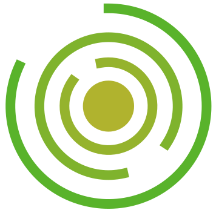
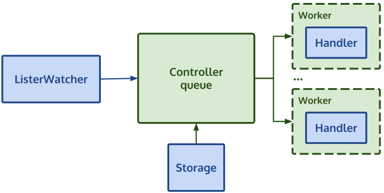
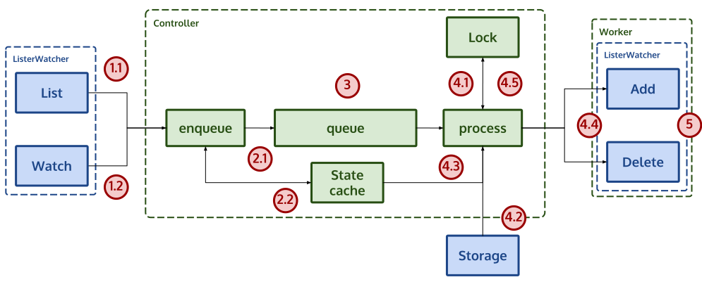

<p align="center">
    
</p>

# Gontroller

A Go library to create [feedback loop/control controllers][control-theory], or in other words... a Go library to create controller without Kubernetes.

## Current state

Alpha state

## Introduction

Kubernetes controllers/operators are based on [controller pattern a.k.a reconciliation loop][what-is-a-controller], this pattern is based on maintaining the desired state and self-heal if it is required. It's a very resilient and robust pattern to maintain and automate tasks.

Kubernetes operators and controllers are awesome but sometimes we want to create them with resources that are not Kubernetes objects/resources (example: Github repositories, Vault secrets, Slack channels...) or we want to convert these objects to Kubernetes CRDs automatically... or we don't use Kubernetes at all but we want to create controllers and operators in a similar way...

Gontroller let's you apply this pattern on non-kubernetes applications. You don't need to use a Kubernetes apiserver to subscribe for events, CRDs... to create an operator/controller, you can use simple structs as objects and you will only need to implement a few interfaces to use this pattern.

## Features

Gontroller is mainly inspired by Kubernetes controllers design and [client-go] internal library implementation with a simplified design and some changes to be more flexible and easy to use. The main features are:

- No Kubernetes dependency.
- Easy to create controllers and operators.
- Automatic retries.
- Ensure only one worker is handling a same object at the same time.
- An object to be processed will be only once on the processing queue.
- Handle all objects at regular intervals (for reconciliation loop) and updated objects on real-time.
- Metrics and Prometheus/Openmetrics implementation.
- Extensible, all is based on behavior (go interfaces) and not concrete types.
- Easy to test, business logic not coupled with infrastructure code (controller implementation/library)

## Getting started

Run the example...

```bash
go run github.com/spotahome/gontroller/examples/stub-funcs-controller
```

And check the [examples] folder to get an idea of how you could create a controller.

## How does it work

The controller is composed by 3 main components:



- ListerWatcher: This piece is the one that will provide the object IDs to the controller queue. Its composed by two internal pieces, the `List`, that will list all object IDs in constant intervals (reconciliation) and the `Watch` that will receive object events (create, modify, delete...).
- Storage: The storage is the one that know how to get the object based on the ListerWatcher enqueued ID and the controller will call this store just before calling the Handler.
- Handler: The handler will handle the `Add` (exists) and `Delete` (doesn't exist) objects queued by the ListerWatcher.

The controller will call the `ListerWatcher.List` method every T interval (e.g. 30s) to enqueue the IDs to process and the `ListerWatcher.Watch` will enqueue real time events to be processed (so there is no need to wait for next List iteration).

The controller will be dequeueing from the queue the IDs to process them but before passing to the workers it will get the object to process from the `Storage`, after getting the object it will call one of the workers to handle it using the `Handler`.

## Internal architecture



1. The `ListerWatcher` will return the object IDs to handle.
   1. The List will be called in interval loop and call the enqueuer with all the listed IDs.
   2. The Watch will return through the channel real-time events of the IDs and the enqueuer will be listening on the channel.
2. The enqueuer will enqueue the object if necessary
   1. The enqueue will check if the ID is already on the internal state cache. If is there it will not send the ID to the queue, if its not there it will send to the controller queue.
   2. It will save new state (present or deleted) of the ID on the internal state cache.
3. The queue has FIFO priority.
4. The processor will process the queued IDs
   1. Will check the internal lock to know if is already being handled. If not it will acquire the lock.
   2. Will get from the `Storage` the object data based on the ID.
   3. Will get the latest state of the object form the State cache.
   4. Will call the handler using one of the workers and pass the object, if the latest state is present it will call `Handler.Add`, if is missing it will call `Handler.Delete`.
   5. When the worker/`Handler` finishes it will release the lock.
5. The `Handler` will execute the business logic for the object.

## FAQ

### Why not use a simple loop?

A loop is simple and in lot of cases it good enough but is not reliable, on the contrary the reconciliation loop gives us a robust state by handling all objects in regular intervals and it acts on real time events, gontroller has also retries, it ensures one object is only being handled concurrently by one worker and that is handling the latest state and not an old one.

### Why only enqueue IDs?

In the end the controller only needs IDs to work (queue, lock...), the business logic is on the handler and is the one that needs the object data, that's why on the step before calling the handler, the store is called to get the latest state.

### How do you ensure a object is handled by a single worker?

The controller uses a internal cache to lock the objects based on the IDs until the worker ends it's work.

### How do you ensure a same object is not repeated N times on the queue?

The controller uses a small cache of what's queued and if is already there it will ignore it

### Why do we need the Storage component?

We could create the `ListerWatcher` to return the whole object (like Kubernetes) instead of the IDs and let the controller maintain the state, but this couples us the input of the queue with the output, and not always are the same.

On the contrary Gontroller takes another design approach making the `ListerWatcher` only return the IDs, this way delegating the retrieval of object data to the last part of the controller (the `Storage`) so listing the objects to be handled don't require all the data.

```text
ListerWatcher -> Controller -> Handler
  │                    ^
  │                    │
  └> Get IDs           └── Storage (Get data from ID)
```

Also with this design you can use the same cache for the ListerWatcher and the `Storage` if you want and you could obtain the same result as a kubernetes style controller/operator by getting the data, storing the data on the `Storage` and returning the IDs:

```text
ListerWatcher -> Controller -> Handler
  │                    ^
  │                    │
  └─────> Storage ─────┘
```

### Can I interact with Kubernetes?

Although you have read on this readme "without Kubernetes", Gontroller handler is not coupled with anything so you could interact with Kubernetes. A very powerful kind of controller could be to convert no CRDs into CRDs.

For example, an organization in Github has Git repositories with a file named `info.json`, this file has info about the repository source code and we have a CRD on Kubernetes that is filled with this info (and some Kubernetes operators that do actions based on this CRD), previously the CRD was made manually, now we will create a controller using Gontroller to convert Git repositories to CRDs based on the content of that file:

- `ListerWatcher`: Lists the Github organization repositories.
- `Store`: Gets a Github repo file content using the ID (eg github.com/spotahome/gontroller) and returns an object with all the data.
- `Handler`: Receives the `Storage` returned object (has the data of the required repo file) and converts to CRD and applies then on Kubernetes.

### Does the lock of object handling work with independent instances?

At this moment this can't be made due to having a lock per controller instance, so if you want to have more than one controller running and be sure that an object is only being handled by one controller and one worker at the same time, you need to use leader election.

We are thinking in letting the user pass a custom lock service to the controller so the controller uses this service to lock the handling of one object at a time. The simplest example to allow this could be having multiple instances of the controller and have a lock that uses a shared Redis by all the instances that is used to Lock.

We are not sure if this is something the users would use or only add complexity, that's why it has not been added at the moment.

[control-theory]: https://en.wikipedia.org/wiki/Control_theory
[what-is-a-controller]: https://book.kubebuilder.io/basics/what_is_a_controller.html
[client-go]: https://github.com/kubernetes/client-go
[examples]: examples
